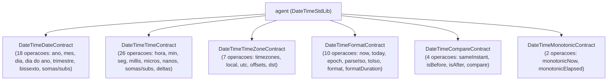

# Plano de Implementação: DateTimeStdLib e Exemplos por Contrato

Este documento detalha a leitura e auditoria de `fluxold/DateTimeStdLib.fdsl`, o levantamento e inclusão de operações faltantes (datas, tempos com frações até nanossegundos e fusos horários), a migração e padronização para `stdlib/DateTimeStdLib.fdsl`, a implementação do suporte de execução nos backends, a criação dos exemplos modulares em `flux/` e a certificação final nos 6 backends com remoção dos arquivos legados em `fluxold/`.

---

## 1. Diagnóstico do Arquivo `fluxold/DateTimeStdLib.fdsl`

Ao inspecionar `fluxold/DateTimeStdLib.fdsl`, foram constatadas as seguintes características e lacunas:
1. **Nomeclatura e Estrutura Legada**:
   - O arquivo chama-se `DateTimeStdLib.fdsl`, porém declarava apenas um único contrato `TimeContract` e o agente `agent (TimeStdLib)`.
   - Todas as outras bibliotecas em `stdlib/` (`StringStdLib`, `ListStdLib`, `SetStdLib`, `IoStdLib`, `MathStdLib`, etc.) utilizam contratos modulares por domínio e o agente com o mesmo nome do módulo (`DateTimeStdLib`).
   - O prefixo canônico das operações deve ser `dateTime*`, mantendo aliases retrocompatíveis (`time*` e formas simples como `year`, `hour`, `now`, etc.).

2. **Lacunas Identificadas nas Operações**:
   - **Datas (dias, meses e anos)**:
     - *Presentes*: `createDate`, `year`, `month`, `day`, `weekday`, `addDays`, `subtractDays`, `addMonths`, `subtractMonths`, `addYears`, `subtractYears`, `isLeapYear`, `daysBetween`.
     - *Faltantes*:
       - `dateTimeDayOfYear` (dia do ano: 1..366)
       - `dateTimeDaysInMonth` (dias do mês: 28, 29, 30, 31)
       - `dateTimeQuarter` (trimestre: 1..4)
       - `dateTimeIsWeekend` (booleano: sábado ou domingo)
       - `dateTimeMonthsBetween` (diferença em meses completos)
       - `dateTimeYearsBetween` (diferença em anos completos)
   - **Tempos (horas, minutos, segundos e frações até nanossegundos)**:
     - *Presentes*: `createTime`, `hour`, `minute`, `second`, `addHours`, `subtractHours`, `addMinutes`, `subtractMinutes`, `addSeconds`, `subtractSeconds`, `hoursBetween`, `minutesBetween`, `secondsBetween`, `millisecondsBetween`, `microsecondsBetween`, `nanosecondsBetween`.
     - *Faltantes*:
       - Extração de frações de subsegundos: `dateTimeMillisecond` (0..999), `dateTimeMicrosecond` (0..999999), `dateTimeNanosecond` (0..999999999).
       - Aritmética de frações: `dateTimeAddMilliseconds` / `dateTimeSubtractMilliseconds`, `dateTimeAddMicroseconds` / `dateTimeSubtractMicroseconds`, `dateTimeAddNanoseconds` / `dateTimeSubtractNanoseconds`.
       - Criação com frações: `dateTimeCreateTimeFull(hour, minute, second, millisecond, microsecond, nanosecond)`.
   - **Fusos Horários**:
     - *Presentes*: `toTimeZone`, `toLocal`, `toUtc`, `utcOffset`, `localTimeZone`, `isDaylightSavingTime`, `dstOffset`.
     - *Padronização*: assinaturas consistentes em contrato dedicado `DateTimeTimeZoneContract`.

3. **Mecanismo de Execução**:
   - Em `fluxold/DateTimeStdLib.fdsl`, as operações invocam funções intrínsecas de sistema (`stdDateTime*`, `stdGetCurrentTimeNsString`, `stdFormatDurationNs`), análogo ao `IoStdLib.fdsl` que invoca `stdIo*`.
   - Atualmente, esses intrínsecos de data/hora não estavam implementados nos backends (`interpreter.py`, `vm/runtime.py`, `llvm/codegen.py`, `wat/codegen.py`, `wasm/codegen.py`).

---

## 2. Contratos Modulares Propostos para `stdlib/DateTimeStdLib.fdsl`



### 2.1. `DateTimeDateContract` (18 Operações)
1. `dateTimeCreateDate(as int64: year_value, as int64: month_value, as int64: day_value) as datetime`
2. `dateTimeYear(as datetime: value) as int64`
3. `dateTimeMonth(as datetime: value) as int64`
4. `dateTimeDay(as datetime: value) as int64`
5. `dateTimeWeekday(as datetime: value) as int64` (1=segunda .. 7=domingo)
6. `dateTimeDayOfYear(as datetime: value) as int64` (1..366)
7. `dateTimeDaysInMonth(as datetime: value) as int64` (28..31)
8. `dateTimeQuarter(as datetime: value) as int64` (1..4)
9. `dateTimeIsLeapYear(as datetime: value) as bool`
10. `dateTimeIsWeekend(as datetime: value) as bool`
11. `dateTimeAddDays(as datetime: value, as int64: amount) as datetime`
12. `dateTimeSubtractDays(as datetime: value, as int64: amount) as datetime`
13. `dateTimeAddMonths(as datetime: value, as int64: amount) as datetime`
14. `dateTimeSubtractMonths(as datetime: value, as int64: amount) as datetime`
15. `dateTimeAddYears(as datetime: value, as int64: amount) as datetime`
16. `dateTimeSubtractYears(as datetime: value, as int64: amount) as datetime`
17. `dateTimeDaysBetween(as datetime: left, as datetime: right) as int64`
18. `dateTimeMonthsBetween(as datetime: left, as datetime: right) as int64`
19. `dateTimeYearsBetween(as datetime: left, as datetime: right) as int64`

### 2.2. `DateTimeTimeContract` (26 Operações)
1. `dateTimeCreateTime(as int64: hour_value, as int64: minute_value, as int64: second_value) as datetime`
2. `dateTimeCreateTimeFull(as int64: hour_value, as int64: minute_value, as int64: second_value, as int64: millisecond_value, as int64: microsecond_value, as int64: nanosecond_value) as datetime`
3. `dateTimeHour(as datetime: value) as int64`
4. `dateTimeMinute(as datetime: value) as int64`
5. `dateTimeSecond(as datetime: value) as int64`
6. `dateTimeMillisecond(as datetime: value) as int64` (0..999)
7. `dateTimeMicrosecond(as datetime: value) as int64` (0..999999)
8. `dateTimeNanosecond(as datetime: value) as int64` (0..999999999)
9. `dateTimeAddHours(as datetime: value, as int64: amount) as datetime`
10. `dateTimeSubtractHours(as datetime: value, as int64: amount) as datetime`
11. `dateTimeAddMinutes(as datetime: value, as int64: amount) as datetime`
12. `dateTimeSubtractMinutes(as datetime: value, as int64: amount) as datetime`
13. `dateTimeAddSeconds(as datetime: value, as int64: amount) as datetime`
14. `dateTimeSubtractSeconds(as datetime: value, as int64: amount) as datetime`
15. `dateTimeAddMilliseconds(as datetime: value, as int64: amount) as datetime`
16. `dateTimeSubtractMilliseconds(as datetime: value, as int64: amount) as datetime`
17. `dateTimeAddMicroseconds(as datetime: value, as int64: amount) as datetime`
18. `dateTimeSubtractMicroseconds(as datetime: value, as int64: amount) as datetime`
19. `dateTimeAddNanoseconds(as datetime: value, as int64: amount) as datetime`
20. `dateTimeSubtractNanoseconds(as datetime: value, as int64: amount) as datetime`
21. `dateTimeHoursBetween(as datetime: left, as datetime: right) as int64`
22. `dateTimeMinutesBetween(as datetime: left, as datetime: right) as int64`
23. `dateTimeSecondsBetween(as datetime: left, as datetime: right) as int64`
24. `dateTimeMillisecondsBetween(as datetime: left, as datetime: right) as int64`
25. `dateTimeMicrosecondsBetween(as datetime: left, as datetime: right) as int64`
26. `dateTimeNanosecondsBetween(as datetime: left, as datetime: right) as int64`

### 2.3. `DateTimeTimeZoneContract` (7 Operações)
1. `dateTimeToTimeZone(as datetime: value, as string: timezone_name) as string`
2. `dateTimeToLocal(as datetime: value) as string`
3. `dateTimeToUtc(as datetime: value) as datetime`
4. `dateTimeUtcOffset(as datetime: value, as string: timezone_name) as float64`
5. `dateTimeLocalTimeZone() as string`
6. `dateTimeIsDaylightSavingTime(as datetime: value, as string: timezone_name) as bool`
7. `dateTimeDstOffset(as datetime: value, as string: timezone_name) as float64`

### 2.4. `DateTimeFormatContract` (10 Operações)
1. `dateTimeEpoch() as datetime`
2. `dateTimeNow() as datetime`
3. `dateTimeToday() as datetime`
4. `dateTimeTime() as datetime`
5. `dateTimeNowFormatted() as string`
6. `dateTimeFormatDuration(as int64: duration_ns) as string`
7. `dateTimeParseIso(as string: text) as datetime`
8. `dateTimeToIso(as datetime: value) as string`
9. `dateTimeToString(as datetime: value) as string`
10. `dateTimeFormat(as datetime: value, as string: pattern) as string`

### 2.5. `DateTimeCompareContract` (4 Operações)
1. `dateTimeSameInstant(as datetime: left, as datetime: right) as bool`
2. `dateTimeIsBefore(as datetime: left, as datetime: right) as bool`
3. `dateTimeIsAfter(as datetime: left, as datetime: right) as bool`
4. `dateTimeCompare(as datetime: left, as datetime: right) as int64` (-1 se left < right, 0 se igual, 1 se left > right)

### 2.6. `DateTimeMonotonicContract` (2 Operações)
1. `dateTimeMonotonicNow() as int64` (relógio monotônico de alta precisão em nanossegundos, imune a alterações de NTP/horário civil)
2. `dateTimeMonotonicElapsed(as int64: start_time_ns) as int64` (diferença monotônica em nanossegundos)

---

## 3. Implementação nos Backends (Suporte aos Intrínsecos `stdDateTime*`)

Para que os programas Flux que utilizam `DateTimeStdLib` executem com 100% de conformidade:

1. **Interpretador AST (`src/flux_proto/interpreter/interpreter.py`)**:
   - Implementar o despachante das funções `stdDateTime*`, `stdGetCurrentTimeNsString` e `stdFormatDurationNs`.
   - Utilizar cálculos de nanossegundos e biblioteca padrão `datetime` / `zoneinfo` do Python para conversões de calendário, fusos horários e formatos ISO.
2. **VM Bytecode e Runtime (`src/flux_proto/vm/runtime.py`)**:
   - Adicionar as funções `stdDateTime*` no dicionário `_BUILTINS`.
   - Atualizar a classe `_DT` para implementar operadores relacionais (`<`, `>`, `<=`, `>=`) de forma a viabilizar comparações diretas de instantes.
3. **LLVM Backend (`src/flux_proto/llvm/runtime/flux_input.c` e `codegen.py`)**:
   - Implementar em C no runtime de entrada/sistema as funções de cálculo de data/tempo baseadas no inteiro de nanossegundos e timestamps Unix, e mapeá-las em `llvm/codegen.py`.
4. **WAT / WASM Backends (`src/flux_proto/wat/codegen.py` e `src/flux_proto/wasm/codegen.py`)**:
   - Implementar funções auxiliares WAT/WASM para cálculo civil de data/hora a partir de nanossegundos (algoritmo civil Hinnant já presente no codegen) e avaliação determinística das operações de data/hora.

---

## 4. Criação dos Exemplos Modulares em `flux/`

Criar 6 exemplos em `flux/`, divididos pelos contratos da biblioteca (modelo com saídas determinísticas e verificações estruturadas):
1. `flux/ExampleOfUseDateTimeStdLib_DateTimeDateContract.flux`
2. `flux/ExampleOfUseDateTimeStdLib_DateTimeTimeContract.flux`
3. `flux/ExampleOfUseDateTimeStdLib_DateTimeTimeZoneContract.flux`
4. `flux/ExampleOfUseDateTimeStdLib_DateTimeFormatContract.flux`
5. `flux/ExampleOfUseDateTimeStdLib_DateTimeCompareContract.flux`
6. `flux/ExampleOfUseDateTimeStdLib_DateTimeMonotonicContract.flux`

> [!TIP]
> Os testes de data/tempo usam âncoras temporais fixas (ex: `2025-06-15T10:30:05.123456789Z`, `2024-02-29T00:00:00.000000000Z`) para garantir que todas as extrações, frações, cálculos de ano bissexto e formatações gerem saídas 100% idênticas e determinísticas entre todos os 6 backends no `backend_compliance.py`. As funções de relógio do sistema (`now()`, `today()`) são verificadas por invariantes lógicos (`isAfter(now(), epoch()) == true`, `nowFormatted() != ""`).

---

## 5. Plano de Verificação e Certificação

### 5.1. Testes Automatizados
```bash
# 1. Executar suíte completa do interpretador (deve reportar 204 sucessos, 0 falhas)
python exemplos_in.py

# 2. Executar suíte da VM (bytecode in-memory e recarregado)
python exemplos_vm.py
python exemplos_vmr.py

# 3. Executar suíte nativa LLVM
python exemplos_lv.py

# 4. Executar suíte WAT e WASM
python exemplos_wat.py
python exemplos_was.py

# 5. Executar matriz completa de conformidade de backends
python backend_compliance.py
```

### 5.2. Limpeza Pós-Certificação
Após a certificação com sucesso em todos os 6 backends:
- Remover `fluxold/DateTimeStdLib.fdsl`
- Remover `fluxold/ExampleOfUseDateTimeStdLib.flux`
- Remover a pasta `fluxold/` se vazia.
