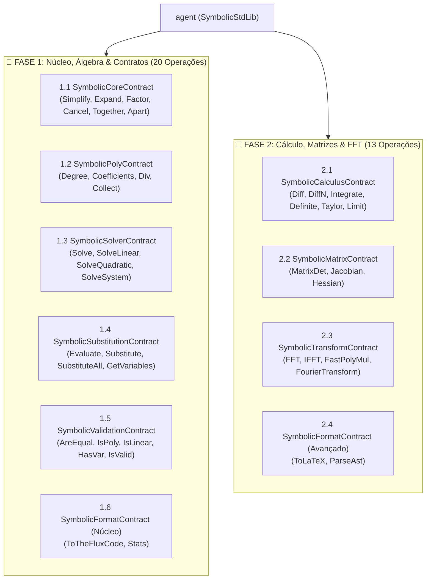

# SymbolicStdLib — Biblioteca Padrão de Álgebra Computacional e Simbólica (TheFlux)

Para a **SymbolicStdLib**, o foco da biblioteca na linguagem TheFlux é atuar como um **ecossistema de computação simbólica analítica e álgebra computacional exata**.

Diferente da `MathStdLib` (que resolve cálculos numéricos aproximados de ponto flutuante com precisão estrita de 0.0 a 0.5 ULP, como `sin64(x)`), esta biblioteca manipula expressões matemáticas como **estruturas analíticas exatas (árvores de termos e polinômios canônicos)**.

No modelo linear e reativo da TheFlux, ela se torna uma ferramenta de poder sem precedentes: permite realizar a **otimização semântica e verificação formal de contratos em tempo de compilação ou execução**, simplificando ou provando analiticamente asserções pesadas de blocos `contract:` antes mesmo que as instruções toquem o hardware.

---

> [!IMPORTANT]
> ### Regra Fundamental de Sintaxe: `^e` como ÚNICA Notação de Exponenciação
> Na linguagem TheFlux, a sintaxe de potenciação é única e exclusivamente **`^e`** (ex: `x ^e 2`, `(a + b) ^e 3`, `e ^e (i * pi)`).
> 
> O parser léxico e sintático da `SymbolicStdLib` **rejeita estritamente** qualquer outro operador de potência (como `^` ou `**`). Expressões que utilizarem operadores não conformes serão rejeitadas na fronteira do pipeline emitindo falha imediata:
> `emit(fail, "", "erro sintatico: exponenciacao deve usar exclusivamente o operador ^e")`.
> 
> Todas as operações de entrada, transformação analítica, simplificação e saída serializada em string adotam estritamente o operador **`^e`**.

---

## 💎 Tipos de Domínio Exportados pela DSL (Adoção da Opção 3)

Com a adoção da **Opção 3** (habilitando o compilador TheFlux a exportar `structs` e `enums` declarados dentro de módulos `.fdsl`), a **`SymbolicStdLib`** define e exporta seus próprios tipos nominais fortes, eliminando a dependência exclusiva de strings cruas e permitindo inspeção estática da AST algébrica:

```theflux
#L --- Enum de Tipos de Nós da AST Simbólica ---
enum (SymbolicNodeType) {
      SYMBOL,
      NUMBER,
      ADD,
      SUB,
      MUL,
      DIV_INT,
      DIV_FLOAT,
      POW,
      NEG,
      FUNC
}

#L --- Enum de Domínio e Restrições de Variáveis ---
enum (SymbolicVarClass) {
      REAL,
      COMPLEX,
      POSITIVE,
      INTEGER
}

#L --- Struct de Nó da AST Algébrica ---
struct (SymbolicNode) {
      mut: .type: SymbolicNodeType
      mut: .value: string
      mut: .children: list of data
}

#L --- Struct de Métricas e Complexidade da Expressão ---
struct (SymbolicStats) {
      imut: .node_count: int64
      imut: .depth: int64
      imut: .variable_count: int64
      imut: .is_canonical: bool
}

#L --- Struct de Resultado de Divisão Polinomial ---
struct (SymbolicPolyDivideResult) {
      imut: .quotient: string
      imut: .remainder: string
}

#L --- Struct de Solução Analítica ---
struct (SymbolicSolution) {
      imut: .variable: string
      imut: .solutions: list of data
      imut: .is_exact: bool
}
```

Dessa forma, qualquer programa `.flux` que declarar `use SymbolicStdLib` terá acesso imediato aos tipos `SymbolicNode`, `SymbolicStats`, `SymbolicPolyDivideResult`, `SymbolicSolution`, `SymbolicNodeType` e `SymbolicVarClass` com validação estrita em tempo de compilação.

---

## 🎯 1. Divisão Estratégica em Fases (Roadmap de Implementação)

Para garantir a máxima confiabilidade, entrega incremental e conformidade estrita nos 6 backends do ecossistema TheFlux (`in`, `vm`, `vmr`, `llvm`, `wat`, `wasm`), o desenvolvimento da **`SymbolicStdLib`** é estruturado em **duas fases sequenciais bem delimitadas**:

| Dimensão | 🌟 Fase 1: Núcleo & Álgebra (MVP) | 🚀 Fase 2: Cálculo, Matrizes & FFT |
| :--- | :--- | :--- |
| **Objetivo Central** | Motor analítico fundamental, simplificação, polinomiais, solvers e validação de contratos | Análise contínua superior, matrizes simbólicas, FFT e transformadas integrais |
| **Contratos Atendidos** | 5 contratos completos + 1 parcial (20 operações) | 3 contratos completos + 1 parcial (13 operações) |
| **Regra de Potência** | Estritamente `^e` (parser Shunting-Yard canônico) | Estritamente `^e` em derivadas, Taylor e Fourier |
| **Tipos Utilizados** | `string`, `int64`, `float64`, `bool`, `list`, `map` | `string`, `float64`, `list`, `map`, `complex` (`a + bi`) |
| **Foco em Contratos** | Suporte direto a asserções de contratos (`symbolicAreEqual`, etc.) | Otimização avançada de modelos de física e processamento de sinal |
| **Exemplos Canônicos** | `flux/ExampleOfUseSymbolicStdLib_*.flux` (Fase 1) | `flux/ExampleOfUseSymbolicStdLib_*.flux` (Fase 2) |



---

## 🌟 2. FASE 1 — Núcleo, Álgebra Simbólica & Predicados de Contrato

A **Fase 1** estabelece as fundações matemáticas do motor analítico. Ela entrega o parser canônico, a representação de termos simplificados, a resolução de equações do primeiro e segundo graus e todos os predicados booleanos necessários para blindar blocos `contract:`.

### ⚡ 2.1 SymbolicCoreContract (Simplificação e Redução Canônica) [Fase 1]
Operações fundamentais de simplificação e manipulação de formas algébricas normais:

- **`symbolicSimplify (as string: expression) as string`**
  Simplifica expressões algébricas reduzindo termos redundantes, somando coeficientes semelhantes e cancelando identidades básicas. Transforma automaticamente strings como `"(x * 4) /i 2 + x"` em `"3 * x"`.
- **`symbolicExpand (as string: expression) as string`**
  Aplica a propriedade distributiva e o binômio de Newton em produtos e potências inteiras. Transforma `"(x + y) ^e 2"` em `"x ^e 2 + 2 * x * y + y ^e 2"`.
- **`symbolicFactor (as string: expression) as string`**
  Realiza a fatoração algébrica polinomial exata sobre os inteiros/racionais. Transforma `"x ^e 2 - 1"` em `"(x - 1) * (x + 1)"` e `"x ^e 2 + 2 * x + 1"` em `"(x + 1) ^e 2"`.
- **`symbolicCancel (as string: expression) as string`**
  Cancela fatores comuns entre numerador e denominador de uma fração racional. Transforma `"(x ^e 2 - 1) / (x - 1)"` em `"x + 1"`.
- **`symbolicTogether (as string: expression) as string`**
  Combina uma soma de frações algébricas sobre um único denominador comum reduzido.
- **`symbolicApart (as string: expression, as string: variable) as string`**
  Decompõe frações racionais em frações parciais em relação à variável informada (essencial para análise e controle linear).

---

### 📐 2.2 SymbolicPolyContract (Álgebra Polinomial Estruturada) [Fase 1]
Tratamento formal e analítico de polinômios univariados e multivariados:

- **`symbolicDegree (as string: expression, as string: variable) as int64`**
  Retorna o grau máximo do polinômio em relação à variável indicada. Exemplo: `symbolicDegree("4 * x ^e 3 + 2 * x", "x")` retorna `3`.
- **`symbolicCoefficients (as string: expression, as string: variable) as list of data`**
  Extrai os coeficientes escalares do polinômio ordenados do termo independente até o grau mais alto `[c0, c1, c2, ...]`.
- **`symbolicPolynomialDivide (as string: numerator, as string: denominator, as string: variable) as SymbolicPolyDivideResult`**
  Executa a divisão euclidiana de polinômios com resto, retornando uma struct `SymbolicPolyDivideResult` com os campos `.quotient` e `.remainder`.
- **`symbolicCollect (as string: expression, as string: variable) as string`**
  Agrupa os termos de uma expressão polinomial como potências ordenadas da variável alvo. Transforma `"a * x + b * x + c"` em `"(a + b) * x + c"`.

---

### 🧩 2.3 SymbolicSolverContract (Resolução de Equações e Sistemas) [Fase 1]
Isolamento analítico de variáveis e busca de raízes exatas:

- **`symbolicSolve (as string: equation, as string: variable) as list of data`**
  Resolve a equação igualada a zero analiticamente, retornando uma lista com as raízes exatas encontradas (ex: resolver `"x ^e 2 - 4 = 0"` para `"x"` retorna `[-2.0, 2.0]`).
- **`symbolicSolveLinear (as string: equation, as string: variable) as float64`**
  Solver determinístico de alta performance para equações de 1º grau ($a \cdot x + b = 0$). Emite erro com `emit(fail)` se for impossível ou indeterminada.
- **`symbolicSolveQuadratic (as string: equation, as string: variable) as list of data`**
  Resolve equações do 2º grau ($a \cdot x ^e 2 + b \cdot x + c = 0$). Se o discriminante for negativo ($\Delta < 0$), retorna raízes complexas na sintaxe nativa da TheFlux (`a + bi`).
- **`symbolicSolveSystem (as list of data: equations, as list of data: variables) as map`**
  Resolve analiticamente sistemas de equações lineares 2x2 ou 3x3 por eliminação gaussiana simbólica, retornando um mapa `{var: valor}`.

---

### 🔄 2.4 SymbolicSubstitutionContract (Avaliação e Substituição) [Fase 1]
Substituição controlada de símbolos por números ou por novas sub-expressões:

- **`symbolicSubstitute (as string: expression, as string: variable, as string: replacement) as string`**
  Substitui todas as ocorrências da variável informada por uma **outra expressão simbólica**. Exemplo: substituir `"x"` por `"2 * t + 1"` em `"x ^e 2"` retorna `"(2 * t + 1) ^e 2"`.
- **`symbolicSubstituteAll (as string: expression, as map: replacements) as string`**
  Executa substituição simbólica simultânea de múltiplos símbolos a partir de um mapa de regras `{"x": "u + v", "y": "u - v"}`.
- **`symbolicEvaluate (as string: expression, as map: variables) as float64`**
  Substitui os símbolos pelos valores numéricos informados e calcula o resultado final com a precisão rigorosa da `MathStdLib`.
- **`symbolicGetVariables (as string: expression) as list of data`**
  Varre a expressão analítica e retorna a lista ordenada com os identificadores textuais de todas as variáveis/símbolos únicos presentes.

---

### 🛡️ 2.5 SymbolicValidationContract (Predicados para Contratos) [Fase 1]
Predicados booleanos determinísticos projetados especificamente para blocos `contract:`:

- **`symbolicAreEqual (as string: expr1, as string: expr2) as bool`**
  Verifica se duas expressões são algebricamente equivalentes: reduz analiticamente a diferença `expr1 - (expr2)` e retorna `true` se simplificar para `0`.
- **`symbolicIsPolynomial (as string: expression, as string: variable) as bool`**
  Garante que a expressão fornecida é um polinômio válido na variável informada (sem termos racionais, radicais ou variáveis no expoente).
- **`symbolicIsLinear (as string: expression, as string: variable) as bool`**
  Valida se a equação ou expressão é estritamente linear em relação à variável informada (grau exatamente 1).
- **`symbolicHasVariable (as string: expression, as string: variable) as bool`**
  Verifica se a expressão possui dependência explícita da variável indicada.
- **`symbolicIsValidExpression (as string: expression) as bool`**
  Validador léxico e sintático estrito. Garante que a expressão está bem-formada e respeita a regra mandatória de potenciação com `^e`.

---

### 📄 2.6 SymbolicFormatContract — Parte 1: Código TheFlux & Métricas [Fase 1]
Interoperabilidade imediata e inspeção de complexidade:

- **`symbolicToTheFluxCode (as string: expression) as string`**
  Converte a expressão analítica em código fonte TheFlux 100% válido, empregando os operadores próprios da linguagem (`/f`, `/i`, `^e`).
- **`symbolicStats (as string: expression) as SymbolicStats`**
  Retorna a contagem de nós, profundidade máxima da árvore e número de variáveis únicas.

---

## 🚀 3. FASE 2 — Cálculo Analítico, Matrizes Simbólicas e Transformadas Rápidas

A **Fase 2** expande o motor para o cálculo infinitesimal, álgebra multivariada matricial, análise espectral contínua e convoluções polinomiais rápidas via FFT/NTT em tempo $O(N \log N)$.

### 📈 3.1 SymbolicCalculusContract (Cálculo Analítico Exato) [Fase 2]
Diferenciação, integração e aproximações analíticas rigorosas:

- **`symbolicDifferentiate (as string: expression, as string: variable) as string`**
  Calcula a primeira derivada analítica exata da expressão em relação à variável (ex: derivar `"x ^e 3"` em relação a `"x"` retorna `"3 * x ^e 2"`).
- **`symbolicDiffN (as string: expression, as string: variable, as int64: order) as string`**
  Calcula a derivada de ordem `order` ($n \ge 1$). Exemplo: derivar `"x ^e 4"` com ordem `2` retorna `"12 * x ^e 2"`.
- **`symbolicIntegrate (as string: expression, as string: variable) as string`**
  Calcula a integral indefinida exata (primitiva analítica) em relação à variável informada (ex: integrar `"2 * x"` retorna `"x ^e 2"`).
- **`symbolicDefiniteIntegrate (as string: expression, as string: variable, as float64: lower, as float64: upper) as float64`**
  Calcula o valor numérico exato da integral definida no intervalo $[a, b]$ através do Teorema Fundamental do Cálculo ($F(b) - F(a)$).
- **`symbolicTaylorSeries (as string: expression, as string: variable, as float64: point, as int64: order) as string`**
  Gera a expansão analítica em Série de Taylor/Maclaurin ao redor de `point` até a ordem `order`.
- **`symbolicLimit (as string: expression, as string: variable, as float64: target, as string: direction) as string`**
  Calcula o limite analítico quando a variável tende a `target` pela esquerda (`"left"`), direita (`"right"`) ou ambos (`"both"`).

---

### 🧮 3.2 SymbolicMatrixContract (Álgebra Matricial Simbólica) [Fase 2]
Manipulação matricial analítica com suporte a variáveis e funções:

- **`symbolicMatrixDeterminant (as list of data: matrix_rows) as string`**
  Calcula a expressão analítica simplificada do determinante de uma matriz de expressões simbólicas 2x2 ou 3x3.
- **`symbolicMatrixJacobian (as list of data: expressions, as list of data: variables) as list of data`**
  Calcula a Matriz Jacobiana simbólica de derivadas parciais $\mathbf{J}_{ij} = \frac{\partial f_i}{\partial x_j}$.
- **`symbolicMatrixHessian (as string: expression, as list of data: variables) as list of data`**
  Calcula a Matriz Hessiana simbólica de segundas derivadas parciais $\mathbf{H}_{ij} = \frac{\partial^2 f}{\partial x_i \partial x_j}$.

---

### ⚡ 3.3 SymbolicTransformContract (Transformadas de Fourier, FFT e Álgebra Rápida) [Fase 2]
Transformadas integrais contínuas e algoritmos rápidos de frequência e convolução:

- **`symbolicFourierTransform (as string: expression, as string: t_var, as string: w_var) as string`**
  Calcula a Transformada de Fourier analítica contínua exata: $\mathcal{F}\{f(t)\} = \int_{-\infty}^{\infty} f(t) \cdot e ^e (-i \cdot \omega \cdot t) \, dt$.
- **`symbolicInverseFourierTransform (as string: expression, as string: w_var, as string: t_var) as string`**
  Calcula a Transformada de Fourier inversa analítica exata.
- **`symbolicFFT (as list of data: samples) as list of data`**
  Calcula a Transformada Rápida de Fourier discreta (Radix-2 Cooley-Tukey / Bluestein) em tempo $O(N \log N)$, retornando uma lista contendo instâncias do tipo nativo `complex` da TheFlux (`a + bi`).
- **`symbolicIFFT (as list of data: spectrum) as list of data`**
  Calcula a Transformada Rápida de Fourier inversa discreta normalizada em $O(N \log N)$.
- **`symbolicFastPolynomialMul (as list of data: poly_a, as list of data: poly_b) as list of data`**
  Multiplicação rápida de polinômios de grau arbitrário $N$ em tempo $O(N \log N)$ utilizando convolução circular baseada em FFT e NTT (Number Theoretic Transform), conforme catalogado em `docs/TODO_algo.txt`.

> [!NOTE]
> Enquanto a `SymbolicStdLib` foca na semântica analítica exata e convolução polinomial discreta via FFT, o processamento de sinais em massa para streams de áudio/gráficos em hardware contíguo é complementado pela `SimdStdLib` (utilizando AVX-512 e WASM SIMD `v128`).

---

### 📄 3.4 SymbolicFormatContract — Parte 2: LaTeX e Árvore Nominal Tipada [Fase 2]
Notação tipográfica científica e tipagem nominal forte da AST:

- **`symbolicToLaTeX (as string: expression) as string`**
  Converte a expressão algébrica para notação tipográfica oficial em LaTeX (ex: `"x ^e 2 / (y + 1)"` vira `"\frac{x^{2}}{y + 1}"`).
- **`symbolicParseAst (as string: expression) as SymbolicNode`**
  Transforma uma string em uma árvore de nós nominal tipada `SymbolicNode`, permitindo manipulação direta de nós na AST sem custo de re-parsing textual.

---

## 🏛️ 4. Exemplos de Uso em Contratos da TheFlux

Graças à sua modelagem reativa, a `SymbolicStdLib` permite que contratos verifiquem a correção semântica de equações antes do disparo de loops numéricos pesados:

```theflux
use SymbolicStdLib
use MathStdLib

program (ExemploContratoSimbolico) {
      mut as string: modeloFisico = "(m * v ^e 2) / 2"
      mut as string: modeloExpandido = "0.5 * m * v ^e 2"

      #L O contrato comprova analiticamente que as formulas sao equivalentes
      contract: SymbolicStdLib.symbolicAreEqual(modeloFisico, modeloExpandido)

      #L O contrato assegura que a expressao de controle e estritamente linear
      mut as string: malhaControle = "3.5 * erro + 1.2"
      contract: SymbolicStdLib.symbolicIsLinear(malhaControle, "erro")

      #L Derivada analitica para calculo de trajetoria (Fase 2)
      mut as string: f = "t ^e 3 - 6 * t ^e 2 + 9 * t"
      mut as string: v = SymbolicStdLib.symbolicDifferentiate(f, "t")
      mut as string: a = SymbolicStdLib.symbolicDiffN(f, "t", 2)

      println("Equacao do Espaco:     " + f)
      println("Equacao da Velocidade: " + v)
      println("Equacao da Aceleracao: " + a)

      #L Resolucao exata dos instantes de repouso (v = 0) (Fase 1)
      mut as list of data: raizes = SymbolicStdLib.symbolicSolve(v + " = 0", "t")
      println("Instantes de Repouso:  " + raizes)
}
```

---

## 🏗️ 5. Estratégia de Implementação no Cenário Multi-Backend (Paridade 100%)

Para atender rigorosamente aos padrões de conformidade do [backend_compliance.py](file:///D:/Projetos/TheFlux/backend_compliance.py), a `SymbolicStdLib` adota a seguinte arquitetura:

### A. Implementação 100% Nativa em TheFlux (`SymbolicStdLib.fdsl`)
- Todo o motor simbólico — incluindo o parser de precedência de operadores (Shunting-Yard adaptado para `^e`), a representação da árvore de termos e as regras de simplificação, fatoração e transformadas rápidas (FFT/NTT) — é codificado **diretamente em TheFlux** (`stdlib/SymbolicStdLib.fdsl`), colaborando nativamente com `MathStdLib` e `StringStdLib`.
- **Benefício de Conformidade:** Como o código é escrito na própria linguagem, o mesmo arquivo `.fdsl` compila identicamente para todos os 6 backends (`in`, `vm`, `vmr`, `llvm`, `wat`, `wasm`), garantindo **100% de paridade de saída caractere por caractere** sem divergências de ordenação de termos.
- **Zero Dependências Externas:** Não requer SymPy em runtime no interpretador, não depende de bibliotecas C dinâmicas no LLVM e não requer bindings JavaScript no WebAssembly (funcionando perfeitamente no ambiente CLI headless do Wasmer/WASI).

### B. Otimização em Tempo de Compilação (Comptime Folding)
- Quando expressões matemáticas constantes são passadas em literais de string durante a compilação de contratos, o compilador TheFlux pode acionar o inlining analítico durante o estágio semântico (`semantic/ast_decorator.py`), emitindo o resultado já simplificado diretamente na IR da LLVM ou no bytecode da VM.

### C. O Casamento Rígido com Ownership (`move` / `borrow`)
- **Semântica de Borrow:** Todas as funções de inspeção, identificação de variáveis e validação booleana (`symbolicAreEqual`, `symbolicIsLinear`, `symbolicGetVariables`, `symbolicStats`) operam estritamente por borrow, preservando as strings e nós sem clonagem desnecessária.
- **Semântica de Move:** Funções de transformação estrutural profunda (`symbolicSimplify`, `symbolicFactor`, `symbolicDifferentiate`, `symbolicSolve`) recebem as estruturas de dados como move, consumindo a árvore antiga da AST e emitindo o novo nó simplificado através de `emit(nice, resultado, "ok")`.

---

## 📅 6. Plano de Ação Sequencial de Implementação

```mermaid
flowchart LR
    A["Etapa 1.1<br/>Lexer & Parser Shunting-Yard (^e)"] --> B["Etapa 1.2<br/>Polinômios & Simplificação (Core)"]
    B --> C["Etapa 1.3<br/>Solvers Lineares & Quadráticos"]
    C --> D["Etapa 1.4<br/>Substituição & Validação Contratos"]
    D --> E["Etapa 1.5<br/>Exemplos & Compliance Fase 1 (100% PASS)"]
    E --> F["Etapa 2.1<br/>Cálculo Analítico (Diff / Int)"]
    F --> G["Etapa 2.2<br/>Matrizes Simbólicas"]
    G --> H["Etapa 2.3<br/>FFT & Convolução Rápida"]
    H --> I["Etapa 2.4<br/>Exemplos & Compliance Fase 2 (100% PASS)"]
```



### 🎯 Entregáveis da Fase 1 (✅ Concluído - 100% de Paridade nos 6 Backends):
1. `stdlib/SymbolicStdLib.fdsl` contendo os 6 contratos (`SymbolicCoreContract`, `SymbolicPolyContract`, `SymbolicSolverContract`, `SymbolicSubstitutionContract`, `SymbolicValidationContract`, `SymbolicFormatContract`), `struct`s exportadas (`SymbolicPolyDivideResult`, `SymbolicStats`), parser Shunting-Yard com validação de exponenciação estrita `^e`, simplificação de polinômios multivariados, divisão euclidiana de polinômios, solvers linear/quadrático/2x2, teste de igualdade por Schwartz-Zippel, substituição e inspeção de estatísticas analíticas.
2. Suíte canônica de testes em `flux/` (6/6 backends OK para cada teste):
   - `flux/ExampleOfUseSymbolicStdLib_SymbolicCoreContract.flux` (6/6 OK)
   - `flux/ExampleOfUseSymbolicStdLib_SymbolicPolyContract.flux` (6/6 OK)
   - `flux/ExampleOfUseSymbolicStdLib_SymbolicSolverContract.flux` (6/6 OK)
   - `flux/ExampleOfUseSymbolicStdLib_SymbolicSubstitutionContract.flux` (6/6 OK)
   - `flux/ExampleOfUseSymbolicStdLib_SymbolicValidationContract.flux` (6/6 OK)
   - `flux/ExampleOfUseSymbolicStdLib_SymbolicFormatContract.flux` (6/6 OK)
3. Execução e validação no `backend_compliance.py`:
   - **311/311 arquivos OK** nos 6 backends (`in`, `vm`, `vmr`, `llvm`, `wat`, `wasm`).
   - Total: **1866/1866 checks verdes**.
   - Zero regressões detectadas.