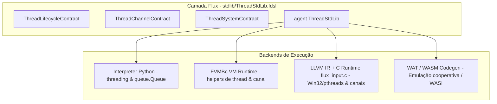

# Plano e Análise Arquitetural: Implementação da `ThreadStdLib` no TheFlux

## 1. Goal Description
Avaliar minuciosamente a pertinência técnica, arquitetural e conceitual do documento [`docs/TODO_ThreadStdLib.md`](file:///D:/Projetos/TheFlux/docs/TODO_ThreadStdLib.md), determinar quais funções são estritamente necessárias e definir a estratégia de implementação: se é viável utilizar 100% Flux puro ou se é mandatório o uso de intrínsecos e extensões do runtime nos 6 backends do compilador (`in`, `vm`, `vmr`, `llvm`, `wat`, `wasm`), garantindo 100% de conformidade com a suíte de testes do projeto.

---

## 2. Parecer Técnico e Análise de Pertinência do Plano

### 2.1 Pontos Fortes e Pertinentes do Plano
- **Modelo CSP (Communicating Sequential Processes)**: O uso de canais com transferência de posse (`move`) encaixa-se perfeitamente na filosofia do TheFlux (imutabilidade padrão, `route`, `emit` e ausência de garbage collector tradicional). Evita os perigos clássicos de concorrência com memória compartilhada mutável.
- **Suporte Multiend Estruturado**: Reconhece a necessidade de rodar no interpretador Python, no binário nativo via LLVM/Clang e no WebAssembly.
- **Primitivas de Concorrência**: `threadYield()` e canais de comunicação são lacunas reais no ecossistema atual do TheFlux.

### 2.2 Inconsistências Críticas e Pontos de Atenção

> [!WARNING]
> **Inconsistência 1: Despacho Dinâmico por String (`agent_name`, `op_name`) vs Tipagem Estática do Compilador**
> A proposta de `threadSpawn (as string: agent_name, as string: op_name, as data: payload)` pressupõe reflexão em tempo de execução via strings. 
> No TheFlux, os backends nativos (LLVM, WASM, WAT) realizam compilação estática estrita (`_collect_called_ops`) e eliminação de código morto. O TheFlux não possui runtime de reflexão dinâmica para converter `"MeuAgente"` e `"minhaOp"` em ponteiros de função em C ou índices de função WAT/WASM.
> Além disso, o TheFlux **já possui na sintaxe da linguagem** as palavras-chave `spawn` (`SpawnExpr`) e `await` (`AwaitExpr`) (vide [`ExampleOfAsync.flux`](file:///D:/Projetos/TheFlux/flux/ExampleOfAsync.flux)), que hoje são avaliadas de forma síncrona. 
> Criar uma função com despacho dinâmico por string na stdlib colide com a evolução natural das keywords `spawn`/`await` do compilador.

> [!IMPORTANT]
> **Inconsistência 2: Redundância com Funções Existentes na `OsStdLib`**
> - `threadHardwareConcurrency()`: É idêntica à já existente `osCpuCount()` / `cpuCount()` em [`stdlib/OsStdLib.fdsl`](file:///D:/Projetos/TheFlux/stdlib/OsStdLib.fdsl) (`OsSystemContract`).
> - `threadSleep(as int64: nanoseconds)`: Sobrepõe `osSleep(as int64: milliseconds)` / `sleep()` de [`stdlib/OsStdLib.fdsl`](file:///D:/Projetos/TheFlux/stdlib/OsStdLib.fdsl). Ademais, resolução de nanossegundos não é garantida pelos escalonadores de SO no Windows e WASM.

> [!CAUTION]
> **Inconsistência 3: Premissa de Web Workers no WebAssembly vs Suíte de Conformidade Wasmer CLI**
> O documento sugere que o backend WASM/WAT inicializará Web Workers no navegador.
> Contudo, a suíte de testes canônica do TheFlux ([`backend_compliance.py`](file:///D:/Projetos/TheFlux/backend_compliance.py)) executa WASM e WAT via **Wasmer CLI** (onde não existe API de DOM ou Web Workers).
> Se o código WASM depender obrigatoriamente de Web Workers para executar, os testes de regressão no Wasmer falharão, quebrando a marca de 1884/1884 testes verdes. O design de WASM/WAT precisa suportar modo síncrono/cooperativo de canais quando rodando em CLI.

---

## 3. É Possível Usar 100% Flux ou É Necessário Intrinsics?

### Resposta Direta
**É tecnicamente IMPOSSÍVEL implementar threads reais e canais concorrentes em 100% Flux puro.**

### Fundamentação Técnica:
1. **Chamadas de Sistema e Kernel**: Spawns de threads de hardware dependem de APIs do kernel (`CreateThread` no Windows, `pthread_create` no Linux/POSIX, `threading.Thread` no Python). O Flux é uma linguagem de alto nível sem inline assembly ou syscalls diretas.
2. **Ausência de Primitivas Atômicas e Mutexes na Sintaxe**: O Flux não possui tipos atômicos (`atomic_int`), barreiras de memória (*memory fences*) ou instruções atômicas (`compare-and-swap`, `mutex`). Tentar manipular uma fila/canal em Flux puro compartilhado entre threads causaria *data races* graves e corrupção de memória.
3. **Escalonamento e Bloqueio**: `threadJoin`, `threadYield` e `channelRecv` necessitam suspender a thread no escalonador do SO. Implementar isso em Flux puro forçaria um loop infinito (*busy-wait*), consumindo 100% de CPU de um núcleo e gerando *thread starvation*.

### A Arquitetura Padrão do TheFlux (Híbrida: Interface em Flux + Intrínsecos Nativos)
Assim como [`OsStdLib.fdsl`](file:///D:/Projetos/TheFlux/stdlib/OsStdLib.fdsl) e [`NetStdLib.fdsl`](file:///D:/Projetos/TheFlux/stdlib/NetStdLib.fdsl):
- O contrato e agente público ficam em [`stdlib/ThreadStdLib.fdsl`](file:///D:/Projetos/TheFlux/stdlib/ThreadStdLib.fdsl) em código **100% Flux**.
- Os corpos das operações delegam para intrínsecos (`stdThread*`, `stdChannel*`), que são implementados nos runtimes nativos de cada backend.

---

## 4. Análise de Necessidade das Funções

| Função Proposta | Status / Necessidade | Justificativa e Recomendação |
| :--- | :--- | :--- |
| `channelCreate() as map` | **Essencial** | Não existe no TheFlux. Cria um canal CSP com par de handles `{"send": ..., "recv": ...}`. |
| `channelSend(port, msg) as bool` | **Essencial** | Não existe no TheFlux. Envio thread-safe com semântica de transferência de posse. |
| `channelRecv(port) as data` | **Essencial** | Não existe no TheFlux. Recepção sincronizada (bloqueante / cooperativa). |
| `threadYield() as bool` | **Essencial** | Não existe no TheFlux. Permite cooperação explícita com o escalonador do SO. |
| `threadSpawn(...)` e `threadJoin(...)` | **Essencial (com ajuste)** | Necessárias para paralelismo, porém devem ser projetadas para evitar despacho dinâmico frágil por string, ou integradas ao pipeline de compilação estática. |
| `threadHardwareConcurrency() as int64` | **Conveniente / Reuso** | Recomenda-se reusar internamente `stdOsCpuCount` de `OsStdLib` para evitar duplicação de lógica de sistema. |
| `threadSleep(as int64: time)` | **Conveniente / Reuso** | Recomenda-se unificar ou reutilizar `stdOsSleep`, avaliando a unidade (milissegundos vs nanossegundos). |

---

## 5. Opções de Arquitetura Explicadas

### 📞 Opção A: O modelo "Lista Telefônica" (Chamar por Texto)
- **Código:** `threadSpawn("MeuAgente", "processarFoto", dados)`
- **Como funciona:** Você entrega o nome do agente e da função em formato de texto. Em tempo de execução, o sistema precisa ler a string, consultar uma tabela interna e invocar o ponteiro correspondente.
- **Vantagens:** Segue à risca a proposta original do documento rascunho.
- **Desvantagens:** Erros de digitação no nome da função só quebram na hora da execução; exige implementar uma tabela global de símbolos dinâmicos nos backends compilados C e WebAssembly.

### 🔘 Opção B: O modelo "Botão Nativo da Máquina" (Sintaxe da Linguagem)
- **Código:** `mut as int64: t = spawn processarFoto(dados)` e `await t`
- **Como funciona:** Aproveita as palavras `spawn` e `await` que o TheFlux já possui no seu vocabulário nativo. O compilador gera código direto para o hardware. A `ThreadStdLib` fornece apenas os **Canais** para comunicação.
- **Vantagens:** Máxima performance, verificação estática de tipos pelo compilador antes de rodar, código idiomático.
- **Desvantagens:** Requer alterar a geração de código dos comandos `spawn`/`await` nos backends do compilador.

### 🧱 Opção C: O modelo "Tubos de Comunicação Primeiro" (Passo a Passo Seguro)
- **Como funciona:** Constrói e valida primeiro a infraestrutura indispensável de canais seguros (`channelCreate`, `channelSend`, `channelRecv`), `threadYield` e `threadHardwareConcurrency`.
- **Vantagens:** Risco zero de regressão sobre os 1.884 testes canônicos existentes; valida a troca de dados antes de plugar o agendador de threads.
- **Desvantagens:** O disparo de tarefas fica para a etapa seguinte.

---

## 6. Proposed Changes (Plano de Implementação Faseado)



### Fase 1: Especificação de Contratos e Agent Flux
#### [NEW] [`stdlib/ThreadStdLib.fdsl`](file:///D:/Projetos/TheFlux/stdlib/ThreadStdLib.fdsl)
- Declaração de `contract (ThreadLifecycleContract)`: `threadSpawn`, `threadJoin`.
- Declaração de `contract (ThreadChannelContract)`: `channelCreate`, `channelSend`, `channelRecv`.
- Declaração de `contract (ThreadSystemContract)`: `threadHardwareConcurrency`, `threadSleep`, `threadYield`.
- Implementação de `agent (ThreadStdLib)` delegando para os intrínsecos `stdThread*` e `stdChannel*`.

### Fase 2: Módulo Auxiliar de Threads no Compilador Python
#### [NEW] [`src/flux_proto/thread_helpers.py`](file:///D:/Projetos/TheFlux/src/flux_proto/thread_helpers.py)
- Estrutura de canais baseada em `queue.Queue` com contadores de referência e identificadores seguros.
- Mapeamento de threads ativas via `threading.Thread`.
- Implementação de `thread_yield()` via `time.sleep(0)`.

### Fase 3: Registro de Intrínsecos nos 6 Backends
#### [MODIFY] [`src/flux_proto/interpreter/interpreter.py`](file:///D:/Projetos/TheFlux/src/flux_proto/interpreter/interpreter.py)
- Interceptar chamadas `stdThread*` e `stdChannel*` direcionando para `thread_helpers.py`.

#### [MODIFY] [`src/flux_proto/vm/runtime.py`](file:///D:/Projetos/TheFlux/src/flux_proto/vm/runtime.py)
- Adicionar entradas na tabela `INTRINSICS` para aridades e mapeamentos das operações de thread e canal.

#### [MODIFY] [`src/flux_proto/llvm/runtime/flux_input.c`](file:///D:/Projetos/TheFlux/src/flux_proto/llvm/runtime/flux_input.c)
- Adicionar suporte a `flux_thread_*` e `flux_channel_*`:
  - No Windows: `CreateThread`, `WaitForSingleObject`, `SwitchToThread`, `CRITICAL_SECTION`.
  - No Linux: `pthread_create`, `pthread_join`, `sched_yield`, `pthread_mutex_t`.
  - Buffer de canal thread-safe circular com mutex/condvar.

#### [MODIFY] [`src/flux_proto/llvm/codegen.py`](file:///D:/Projetos/TheFlux/src/flux_proto/llvm/codegen.py)
- Declaração e geração de chamadas para as funções C de thread e canal.

#### [MODIFY] [`src/flux_proto/wat/codegen.py`](file:///D:/Projetos/TheFlux/src/flux_proto/wat/codegen.py) e [`src/flux_proto/wasm/codegen.py`](file:///D:/Projetos/TheFlux/src/flux_proto/wasm/codegen.py)
- Implementar runtime de canal e yield cooperativo compatível com Wasmer CLI.

### Fase 4: Exemplos Canônicos e Testes de Conformidade
#### [NEW] [`flux/ExampleOfUseThreadStdLib_ThreadChannelContract.flux`](file:///D:/Projetos/TheFlux/flux/ExampleOfUseThreadStdLib_ThreadChannelContract.flux)
#### [NEW] [`flux/ExampleOfUseThreadStdLib_ThreadSystemContract.flux`](file:///D:/Projetos/TheFlux/flux/ExampleOfUseThreadStdLib_ThreadSystemContract.flux)
#### [NEW] [`flux/ExampleOfUseThreadStdLib_ThreadLifecycleContract.flux`](file:///D:/Projetos/TheFlux/flux/ExampleOfUseThreadStdLib_ThreadLifecycleContract.flux)

---

## 7. Verification Plan

### Testes Automatizados
1. **Compilação e execução individual nos 6 backends**:
   ```powershell
   python flux_in.py flux/ExampleOfUseThreadStdLib_ThreadChannelContract.flux
   python flux_vm.py flux/ExampleOfUseThreadStdLib_ThreadChannelContract.flux
   python flux_vmr.py flux/ExampleOfUseThreadStdLib_ThreadChannelContract.flux
   python flux_lv.py flux/ExampleOfUseThreadStdLib_ThreadChannelContract.flux
   python flux_wat.py flux/ExampleOfUseThreadStdLib_ThreadChannelContract.flux
   python flux_was.py flux/ExampleOfUseThreadStdLib_ThreadChannelContract.flux
   ```
2. **Conformidade Global de Backends**:
   ```powershell
   python backend_compliance.py
   ```
   *Critério de aceitação*: Manter 100% de aprovação (todos os testes verdes em todos os backends) sem quebras de regressão.